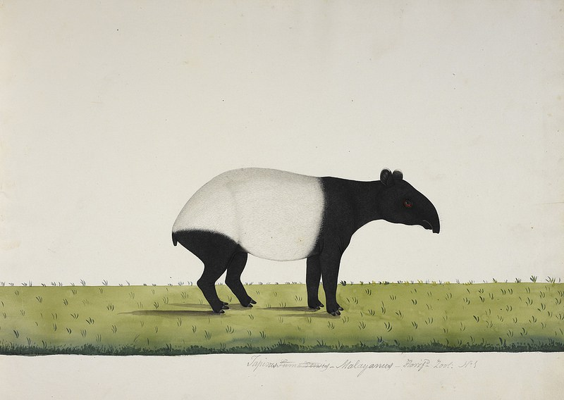

# mem'ry [![npm][npm-image]][npm-url] [![downloads][downloads-image]][downloads-url] [![dependencies][dependency-image]][dependency-url] [![travis][travis-image]][travis-url]

[npm-image]: https://img.shields.io/npm/v/memry.svg
[npm-url]: https://npmjs.org/package/memry
[downloads-image]: https://img.shields.io/npm/dm/memry.svg
[downloads-url]: https://npmjs.org/package/memry
[dependency-image]: https://img.shields.io/david/kpcyrd/memry.svg
[dependency-url]: https://david-dm.org/kpcyrd/memry
[travis-image]: https://img.shields.io/travis/kpcyrd/memry.svg
[travis-url]: https://travis-ci.org/kpcyrd/memry



mem'ry was written for situations where you have to transfer files between two untrusted servers without the risk of compromising your private keys by forwarding your ssh keys (no sane person would do that, right?).

You don't need to install any software on the sending system since standard curl is sufficient. It also works on systems that are running low on disk as there's no need to create temporary files, multiple files can be uploaded by packing them with `tar`, writing the archive to stdout and streaming it into `curl`.

Basically, it's `nc` file transfer for http(s) (except that you actually know if a file was transferred completely or partially).

## Installation

```
npm install -g memry
```

## Usage

```
# upload one file
curl -sST- http://127.0.0.1:8018 < file.bin
# upload multiple files
tar cvvJ files/*.bin.part | curl -T- http://127.0.0.1:8018
# upload log files only readable by root on systems that don't allow ssh as root
sudo tar cvvJ /var/log/nginx | curl -T- http://127.0.0.1:8018
# upload a single file with working progress bar
curl -T file.bin http://127.0.0.1:8018
```

## Usage with docker

```
docker build -t memry .
mkdir storage
docker run --rm -p 80:8018 -v `pwd`/storage:/storage memry
```

## Generate https certificate

```
openssl req -nodes -x509 -newkey rsa:4096 -keyout key.pem -out cert.pem -days 365
```

## Trivia

mem'ry is an archaic term for "memory". The caption in the image reads "The tapir sent from Bengkulu to Calcutta in 1816" and is about 200 years old.

## License

GPLv3
